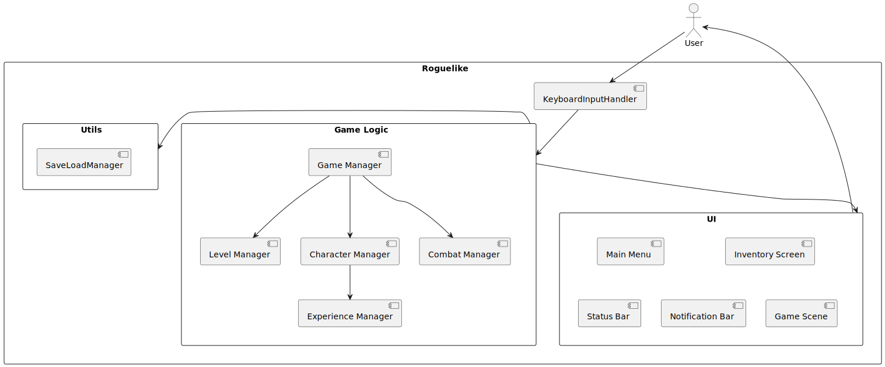

# Архитектурное описание

## Общие сведения о системе

Roguelike — это жанр компьютерных игр, основными характеристиками которых являются процедурно
генерируемые карты,
высокая сложность, управление с клавиатуры и минималистичная графика.

В рамках текущего проекта необходимо реализовать игровую систему, которая представляет собой
консольный roguelike, где
игрок управляет персонажем, путешествующим по подземелью от верхнего уровня к самому нижнему.

Основная цель игры — преодолеть серию процедурно сгенерированных уровней и победить финального
босса. При этом игрок
должен собирать полезные предметы, улучшать характеристики персонажа и избегать или побеждать
врагов.

___

## Architectural Drivers

Учитывая, что мы разрабатываем учебный проект Roguelike, драйверы будут ориентированы на простоту,
модульность и
возможность расширения.

### Функциональные требования

- **Управление персонажем**: поддержка ввода с клавиатуры для перемещения, атаки, взаимодействия с
  объектами на карте и
  взаимодействия с инвентарем
- **Генерация уровней**: процедурная генерация каждого нового уровня подземелья при первом входе на
  уровень
- **Сохранение и загрузка игры**: возможность сохранить текущее состояние уровня и игрока в файл, а
  также загрузить его
  из файла и продолжить игру
- **Инвентарь**: простая система управления вещами, их экипировкой и применением
- **Враги и бой**: простая боевая система с характеристиками, такими как здоровье, сила атаки и
  защиты.
- **Консольная графика**: отображение карты, персонажа и объектов с помощью ASCII-символов.

### Нефункциональные требования

- **Производительность**: время отклика на действие игрока не должно превышать 1 секунды
- **Масштабируемость**: добавление новых уровней, врагов, предметов и механик должно проходить без
  значительных
  изменений в существующем коде
- **Модульность**: код системы должен быть разделен на слабо связанные компоненты для более легкой
  модификации
- **Надежность**: система не должна завершать работу аварийно, все не допустимые явно действия
  должны быть запрещены,
  например:  выход за границы карты, использование предметов не из инвентаря и так далее
- **Реиграбельность**: каждая новая игра должна генерировать первый уровень случайным образом на
  основе произвольного
  seed'а генерации, каждый новый уровень в рамках одной и той же игры также должен генерировать
  случайно на основе не
  только seed'а создания игры, но и действий пользователя

### Технические ограничения

- **Язык программирования**: Kotlin
- **Среда выполнения**: консоль/терминал
- **Кроссплатформенная поддержка**: Windows, macOS, Linux
- **Графика**: только текстовая, с использованием стандартных ASCII-символов
- **Объем проекта**: ~3000 строк кода

### Возможности расширения

- **Добавление новых механик**: легкость внедрения новых предметов, врагов или типов комнат
- **Поддержка различных уровней сложности**: изменение параметров генерации для усложнения или
  упрощения игры

---

## Роли и случаи использования

### Роли

- #### Игрок
  Основной пользователь игры, который управляет персонажем, исследует подземелье, сражается с
  врагами и взаимодействует
  с объектами
    - **Цель**: пройти все уровни подземелья и победить финального босса
    - **Действия**:
        - Перемещение по карте уровня
        - Взаимодействие с предметами на карте
        - Взаимодействие с предметами из инвентаря
        - Битва с врагами
        - Сохранение и загрузка игры

### Use Cases

- #### UC1: Запуск новой игры
    - **Акторы**: Игрок
    - **Описание**: Игрок запускает новую игру
    - **Предусловие**: Игрок находится в главном меню игры
    - **Триггер**: Игрок выбирает опцию "Новая игра"
    - **Основной порядок событий**:
        1. Система генерирует произвольный seed для новой игры
        2. Система генерирует первый уровень игры на основе seed текущей игры
        3. Система отображает карту первого уровня игры и игрока в стартовой позиции текущего уровня

- #### UC2: Передвижение Игрока по уровню
    - **Акторы**: Игрок
    - **Описание**: Игрок использует клавиатуру для передвижения по карте
    - **Предусловие**: Игрок находится на уровне игры
    - **Триггер**: Игрок вводит команду для движения персонажа: клавиша W, A, S или D
    - **Основной порядок событий**:
        1. Система проверяет, возможно ли переместить Игрока в указанном направлении на 1 ячейку
        2. Система обновляет позицию персонажа на карте, если данное передвижение возможно выполнить
        3. Система перерисовывает уровень с учетом обновленной позиции игрока
    - **Альтернативный порядок событий**:
        1. Система не обновляет позицию персонажа на карте, если данное действие невозможно
           выполнить: мешает
           препятствие или противник
        2. Система выводит на экран сообщение о том, что движение в выбранном направлении невозможно

- #### UC3: Взаимодействие Игрока с элементами окружения
    - **Акторы**: Игрок
    - **Описание**: Игрок использует клавиатуру для взаимодействия с элементами окружения
    - **Предусловие**: Игрок находится на уровне игры
    - **Триггер**: Игрок вводит команду для взаимодействия с элементами окружения: клавиша E
    - **Основной порядок событий**:
        1. Система проверяет, есть ли в радиусе 1 ячейки элементы окружения, с которыми можно
           взаимодействовать
        2. Система перерисовывает уровень с результата взаимодействия Игрока с элементом окружения:
            - Если это дверь, то дверь открывается, Игрок видит карту за дверью
            - Если это предмет, то предмет исчезает с карты уровня и перемещается в инвентарь Игрока
    - **Альтернативный порядок событий**:
        1. Система не перерисовывает уровень, если нет элементов окружения для взаимодействия
        2. Система выводит на экран сообщение о том, что нет элементов окружения для взаимодействия

- #### UC4: Бой с ближайшим врагом
    - **Акторы**: Игрок, Враг
    - **Описание**: Игрок вступает в бой с ближайшим Врагом в радиусе атаки оружия
    - **Предусловие**: Игрок находится на уровне игры и в радиусе атаки оружия есть противник
    - **Триггер**: Игрок нажимает клавишу F
    - **Основной порядок событий**:
        1. Система проверяет, есть ли противник в радиусе атаки персонажа
        2. Если противник найден, начинается бой:
            - Система рассчитывает урон, который Игрок наносит противнику
            - Система наносит ответный урон от противника
        3. Система обновляет здоровье Игрока и противника, в зависимости от полученного урона
        4. Система обновляет состояние противника в зависимости от его здоровья или примененных эффектов
        5. Если здоровье противника или Игрока становится равным нулю, бой заканчивается
            - Если Игрок победил, противник исчезает с карты, и система обновляет состояние уровня
            - Если Игрок проиграл, игра заканчивается и выводится сообщение о поражении
    - **Альтернативный порядок событий**:
        1. Если противник не находится в радиусе атаки, система выводит сообщение о невозможности
           атаки

- #### UC5: Взаимодействие с инвентарем
    - **Акторы**: Игрок
    - **Описание**: Игрок открывает инвентарь для управления предметами
    - **Предусловие**: Игрок находится на уровне игры
    - **Триггер**: Игрок нажимает клавишу I
    - **Основной порядок событий**:
        1. Система открывает инвентарь Игрока, отображая список всех предметов, находящихся в нем
        2. Игрок выбирает предмет из инвентаря с помощью консольных команд
        3. Игрок может выбрать действия с предметом:
            - Экипировать предмет: если предмет является экипируемым, система обновляет
              характеристики Игрока
            - Снять предмет: если предмет был экипирован, он перемещается обратно в инвентарь,
              система обновляет
              характеристики Игрока
            - Использовать предмет: если предмет используется (например, зелье), система обновляет
              состояние персонажа и
              убирает предмет из инвентаря
        4. Система возвращает Игрока в игру

- #### UC6: Переход на уровень ниже
    - **Акторы**: Игрок
    - **Описание**: Игрок спускается на уровень ниже подземелья
  - **Предусловие**: Игрок находится на текущем уровне подземелья, и выход на следующий уровень
    находится в той же
      ячейке, что и игрок
    - **Триггер**: Игрок вводит команду для взаимодействия с элементами окружения: клавиша E
    - **Основной порядок событий**:
        1. Система проверяет, что Игрок достиг выхода на новый уровень
        2. Система генерирует новый уровень
        3. Система обновляет карту, отображая новый уровень и позицию Игрока на нем
        4. Игрок продолжает исследование нового уровня
    - **Альтернативный порядок событий**:
        1. Система не перерисовывает уровень, если нет элементов окружения для взаимодействия
        2. Система выводит на экран сообщение о том, что нет элементов окружения для взаимодействия

- #### UC7: Выход из игры
    - **Акторы**: Игрок
    - **Описание**: Игрок выходит из игры, Система сохраняет прогресс игры перед выходом
    - **Предусловие**: Игрок находится в процессе игры
    - **Триггер**: Игрок нажимает клавишу для выхода из игры (например, клавиша Esc)
    - **Основной порядок событий**:
        1. Система выводит элемент пользовательского интерфейса с запрос на подтверждение выхода из
           игры
        2. Игрок выбирает опцию "Выйти"
        3. Система сохраняет текущее состояние игры: позицию Игрока, инвентарь, текущий уровень и
           другие данные, такие
           как здоровье и прогресс
        4. Система завершает игру и возвращает Игрока в главное меню
    - **Альтернативный порядок событий**:
        1. Если Игрок отменяет выход, игра продолжает работать

## Описание типичного пользователя

- **Типичный пользователь системы**: это игрок, заинтересованный в минималистичных играх жанра
  Roguelike с упором на
  стратегическое мышление, исследование мира и управление ресурсами. Такой игрок ценит глубину
  игрового процесса,
  несмотря на простоту визуальной части, и готов погружаться в консольный интерфейс, ориентированный
  на ASCII-графику.
- **Возраст**: от 12 лет
- **Опыт работы с играми**: средний уровень и выше. Пользователь знает типовые игровые механики,
  знаком с жанром RPG,
  готов осваивать игровые механики без внятного обучения

## Композиция

### Основные компоненты системы

* Game (Игровой менеджер): Центральный компонент, управляющий состоянием игры, обработкой
  пользовательского ввода и
  основным игровым циклом.
* Player (Игрок): Класс, представляющий персонажа игрока, его характеристики, инвентарь и действия.
* Level (Уровень): Отвечает за генерацию и управление текущим уровнем, включая карту, врагов,
  предметы и взаимодействие
  с ними.
* Enemy (Враг): Классы, представляющие противников на уровне, их поведение и взаимодействие с
  игроком.
* Inventory (Инвентарь): Система управления предметами игрока, включая экипировку и использование
  предметов.
* Item (Предмет): Абстрактный класс для всех типов предметов в игре, таких как оружие, броня и
  потребляемые предметы.
* UIManager (Менеджер пользовательского интерфейса): Отвечает за отображение информации игроку,
  включая основной экран
  игры, инвентарь, статусную строку и сообщения.
* InputHandler (Обработчик ввода): Обрабатывает пользовательский ввод с клавиатуры и передает
  команды в игровой
  менеджер.
* SaveLoadSystem (Система сохранения и загрузки): Управляет сохранением текущего состояния игры в
  файл и загрузкой
  сохраненных игр.
* CombatSystem (Система боя): Обрабатывает боевые взаимодействия между игроком и врагами, включая
  расчет урона и
  обновление состояния персонажей.
* ExperienceManager (Менеджер опыта): Отвечает за функционал обновления опыта и уровня игрока.
* Utilities (Утилиты): Вспомогательные классы и функции, такие как генератор случайных чисел для
  создания seed и другие
  вспомогательные методы.

### Взаимодействие компонентов

* Game использует InputHandler для обработки ввода от игрока и взаимодействует с UIManager для
  отображения информации.
* Game управляет состоянием Player и Level, обновляя их в соответствии с действиями игрока и игровым
  циклом.
* Level содержит информацию о Tile (ячейках карты), Enemy (врагах) и Item (предметах) на уровне.
* Player взаимодействует с Inventory для управления предметами и с CombatSystem для боя с врагами.
* UIManager отображает информацию из Game, Player, Level и других компонентов игроку.
* SaveLoadSystem взаимодействует с Game для сохранения и загрузки состояния игры.

## Логическая структура

### Основные компоненты и их классы

1. **Game** (Игровой менеджер)

    * Управляет основным игровым циклом и состоянием игры.
    * Методы:

        * `start()`: Запускает новую игру или загружает существующую.
        * `processCommand(input: String)`: Обрабатывает команды игрока.
        * `update()`: Обновляет состояние игры.
        * `checkLevelCompletion()`: Проверяет, завершен ли текущий уровень.
        * `exit()`: Завершает игру и возвращает в главное меню.

2. **Player** (Игрок)

    * Представляет персонажа игрока.
    * Свойства:

        * `name`: Имя игрока.
        * `maxHealth`, `level`, `pointsToNextLevel`, `health`, `baseAttack`, `baseDefense`: Характеристики персонажа.
        * `inventory`: Инвентарь игрока.
        * `position`: Текущее положение на карте.
        * `direction`: Текущее направление игрока.
        * `experienceManager`: Менеджер опыта игрока.

    * Методы:

        * `addExperience(points: Int)`: Добавляет очки опыта игроку.

3. **Level** (Уровень)

    * Представляет текущий уровень игры.
    * Свойства:
        * `map`: Двумерный массив `Tile`, представляющий карту.
        * `enemies`: Список врагов на уровне.
        * `items`: Список предметов на уровне.
        * `exitPosition`: Позиция выхода на следующий уровень.
    * Методы:
        * `generateLevel(seed: int)`: Генерирует новый уровень.
        * `validateMovement(position: Position)`: Проверяет возможность перемещения.
        * `updatePlayerPosition(player: Player)`: Обновляет позицию игрока.
      * `checkForInteractableElements(position: Position)`: Проверяет наличие объектов для
        взаимодействия.
        * `performInteraction(player: Player)`: Выполняет взаимодействие.
        * `checkForEnemiesInRange(player: Player)`: Ищет врагов в радиусе атаки.
        * `removeEnemy(enemy: Enemy)`: Удаляет побежденного врага.
        * `checkLevelCompletion(player: Player)`: Проверяет, достиг ли игрок выхода.

4. **Enemy** (Враг)

    * Представляет противников.
    * Свойства и методы аналогичны `Player`, но с уникальным поведением (состоянием).

5. **Inventory** (Инвентарь)

    * Управляет предметами игрока.
    * Свойства:
        * `items`: Список предметов.
    * Методы:
        * `addItem(item: Item)`, `removeItem(item: Item)`: Добавляет и удаляет предметы.
        * `equipItem(item: Item)`: Экипирует предмет.
        * `unequipItem(item: Item)`: Снимает предмет.

6. **Item** (Предмет)

    * Абстрактный класс для всех предметов.
    * Свойства:
        * `name`, `description`: Информация о предмете.
    * Подклассы:
        * `Weapon`: Оружие, увеличивающее атаку.
        * `Armor`: Броня, увеличивающая защиту.
        * `Consumable`: Потребляемые предметы, такие как зелья.

7. **UIManager** (Менеджер пользовательского интерфейса)

    * Отвечает за отображение информации.
    * Методы:
        * `render()`: Отрисовывает текущий экран.
        * `update()`: Обновляет интерфейс.
        * `showMessage(message: String)`: Показывает сообщения игроку.
        * `confirmExit()`: Запрашивает подтверждение выхода.

8. **InputHandler** (Обработчик ввода)

    * Обрабатывает ввод пользователя.
    * Методы:
        * `processInput(input: String)`: Анализирует и передает команды.

9. **SaveLoadSystem** (Система сохранения и загрузки)

    * Управляет сохранением и загрузкой.
    * Методы:
        * `saveGameState(game: Game)`: Сохраняет состояние игры.
        * `loadGameState(fileName: String)`: Загружает сохраненную игру.
        * `generateRandomSeed()`: Генерирует случайный seed.

10. **CombatSystem** (Система боя)

    * Обрабатывает боевые взаимодействия.
    * Методы:
        * `attack(attacker: Character, defender: Character)`: Выполняет атаку.

11. **ExperienceManager** (Менеджер опыта)

    * Отвечает за функционал обновления опыта и уровня игрока, а также улучшения его характеристик.
    * Методы:
      * `addExperience(points: Int)`: Добавляет опыт игроку. Если опыт позволяет перейти на новый уровень, обновляет уровень и переносит оставшийся опыт на следующий уровень.

### Взаимодействие между компонентами

* Игровой цикл:
    * `Game` получает ввод от `InputHandler`, обрабатывает команды и обновляет состояние.
    * `Game` обновляет `Player` и `Level` на основе действий.
    * `UIManager` отображает изменения, запрашивает подтверждения и показывает сообщения.

* Перемещение и взаимодействие:
    * `Player` вызывает `move()` или `interact()`.
  * `Game` проверяет действия через методы Level (`validateMovement()`,
    `checkForInteractableElements()`).
    * `Level` обновляет карту и взаимодействует с объектами (предметы, двери).

* Бой:
    * `Player` или `Enemy` инициирует атаку.
    * `CombatSystem` рассчитывает урон и обновляет здоровье персонажей.
    * Game проверяет состояние персонажей (жив/мертв) и обновляет `Level` и `UIManager`.

* Инвентарь:
    * `Player` открывает `Inventory`, нажимая `I`.
  * Игрок взаимодействует с инвентарем, используя методы `Inventory` (`removeItem()`,
    `equipItem()`, `unequipItem()`).
    * `Player` обновляет свои характеристики через метод инвентаря `getEquippedArmor()`.

* Сохранение и загрузка:
    * При сохранении Game вызывает `saveGameState()` у `SaveLoadSystem`.
    * При загрузке Game использует `loadGameState()` для восстановления состояния.
    * Потоки данных и управление состоянием

* Поток ввода:
    * Пользовательский ввод обрабатывается `InputHandler`, который преобразует ввод в команды для
      Game.

* Обновление состояния игры:
    * `Game` управляет основным состоянием и вызывает соответствующие методы других компонентов.

* Отображение:
    * `UIManager` получает обновленные данные из `Game`, `Player` и `Level` для отображения игроку.

* Сохранение состояния:
    * Все необходимые данные собираются из `Game`, `Player` и `Level` и сохраняются через
      `SaveLoadSystem`.

## Взаимодействия и состояния

Взаимодействия основных акторов представлены в виде диаграммы последовательности.

Основные акторы:

* пользователь (Player)
* движок игры (Game)
* уровень (Level)
* враг (Enemy)
* инвентарь (Inventory)
* пользовательский интерфейс (UI)
* система управления состояниями игры (SaveLoadSystem)

Система разделена на три составляющие:

1. "До игры"
2. "Игровой цикл"
3. "Переход между уровнями"

Главным актором является пользователь, который взаимодействут с системой с помощью входных команд.

Возможные состояния системы представлены в виде диаграммы конечных автоматов.

Состояния разделены на три компоненты, такие же как на диаграмме последовательности.

